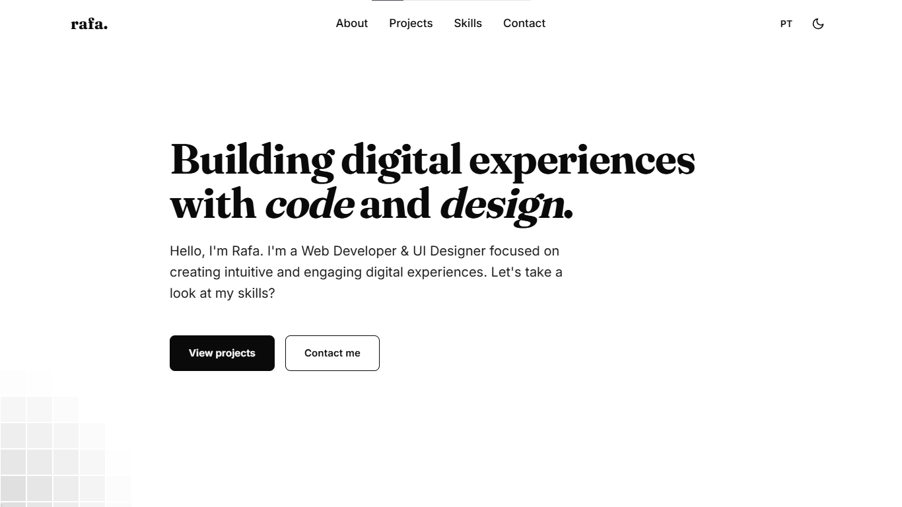

<p align="center">
  
</p>

# Portfolio


My personal portfolio website, built to showcase my skills, projects, and experience as a Frontend Developer & UI Designer.

## ✨ Features

- Modern and responsive design
- Dark & Light mode
- Smooth animations and transitions
- Bilingual (English & Portuguese)
- Interactive UI
- Fully built with vanilla HTML, CSS, and JavaScript

## 🛠️ Technologies

- HTML5
- CSS3
- JavaScript (ES6)

## 🚀 Live Demo

https://aacomputador001-spec.github.io/portfolio/

## 📂 Installation

Clone the repository:

```bash
git clone https://github.com/aacomputador001-spec/portfolio.git
```

Open `index.html` in your browser, or use a local server such as Live Server in VS Code.

## 📬 Contact

- GitHub: https://github.com/aacomputador001-spec
- LinkedIn: https://www.linkedin.com/in/rafael-lemos-rocha-7b14a4423/